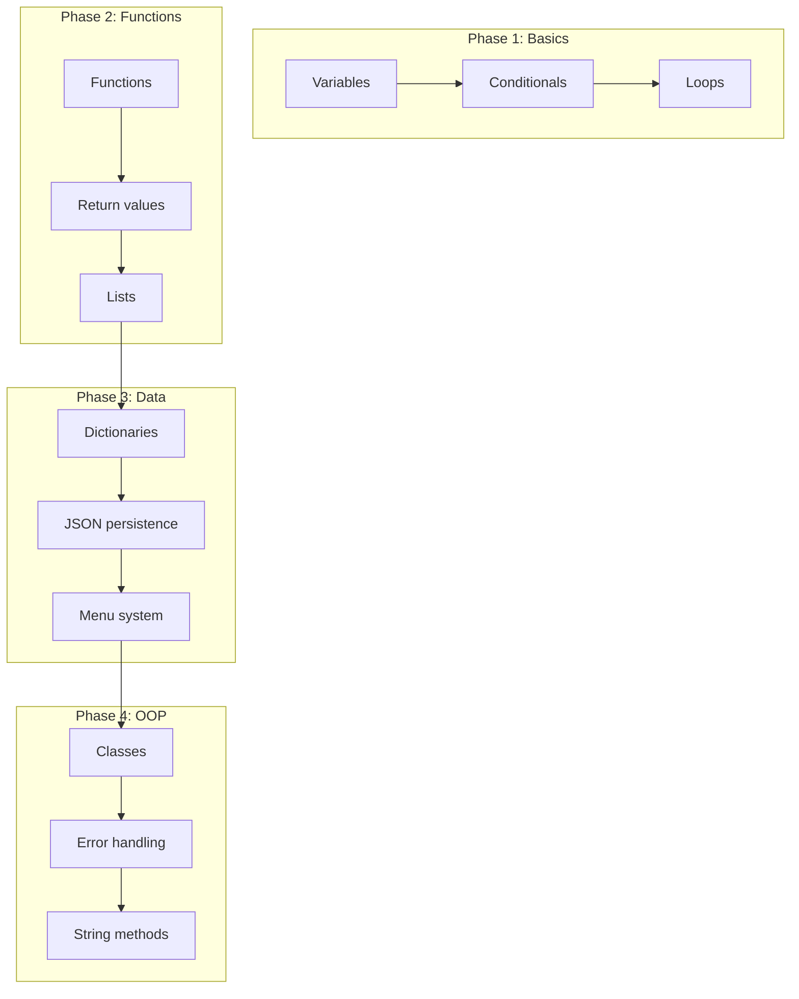
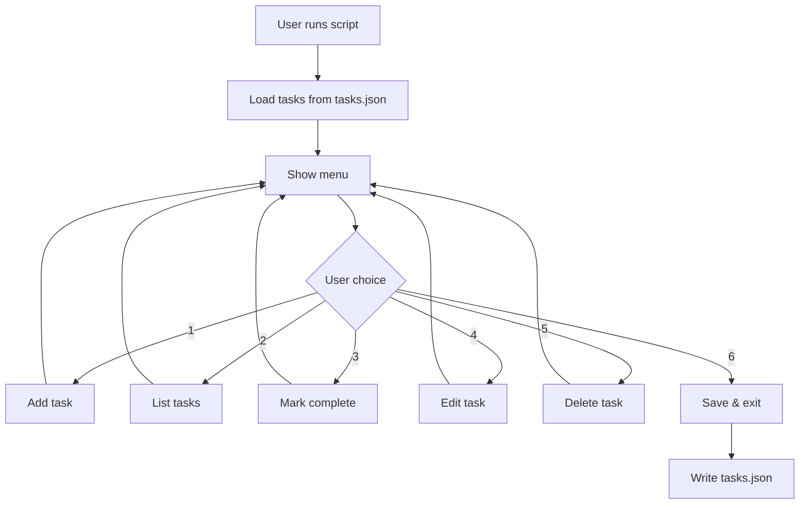

# landonkea-python-learning-exercises — Design & Workflow

## High-Level Overview

```mermaid
graph TB
    subgraph "Progressive Learning Path"
        A[01-greet.py] --> B[02_conditional.py]
        B --> C[03_loop.py]
        C --> D[04_list_loop.py]
        D --> E[05_function.py]
        E --> F[06_return.py]
        F --> G[07-add-list-tasks.py]
        G --> H[08_structured_tasks.py]
        H --> I[09_mark_complete.py]
        I --> J[10_save_tasks.py]
        J --> K[11_load_and_menu.py]
        K --> L[12_edit_and_delete.py]
        L --> M[13_classes.py]
        M --> N[14_error_handling.py]
        N --> O[15_string_methods.py]
    end
```

## Task Manager Evolution

## Final App Workflow

## File Relationships

| File | Purpose | Concepts Taught |
|------|---------|-----------------|
| `01-greet.py` | Hello world | Variables, print |
| `02_conditional.py` | If/else | Conditionals |
| `03_loop.py` | For/while loops | Loops |
| `04_list_loop.py` | List iteration | Lists |
| `05_function.py` | Functions | Functions |
| `06_return.py` | Return values | Return |
| `07-add-list-tasks.py` | Add to list | List mutation |
| `08_structured_tasks.py` | Dict tasks | Dictionaries |
| `09_mark_complete.py` | Toggle complete | State |
| `10_save_tasks.py` | JSON save | File I/O |
| `11_load_and_menu.py` | Load + menu | Menu loop |
| `12_edit_and_delete.py` | Full CRUD | Complete app |
| `13_classes.py` | OOP | Classes |
| `14_error_handling.py` | Try/except | Error handling |
| `15_string_methods.py` | String ops | String methods |

## draw.io

[Open in draw.io](https://app.diagrams.net/#RLearning%20path%20progression)
